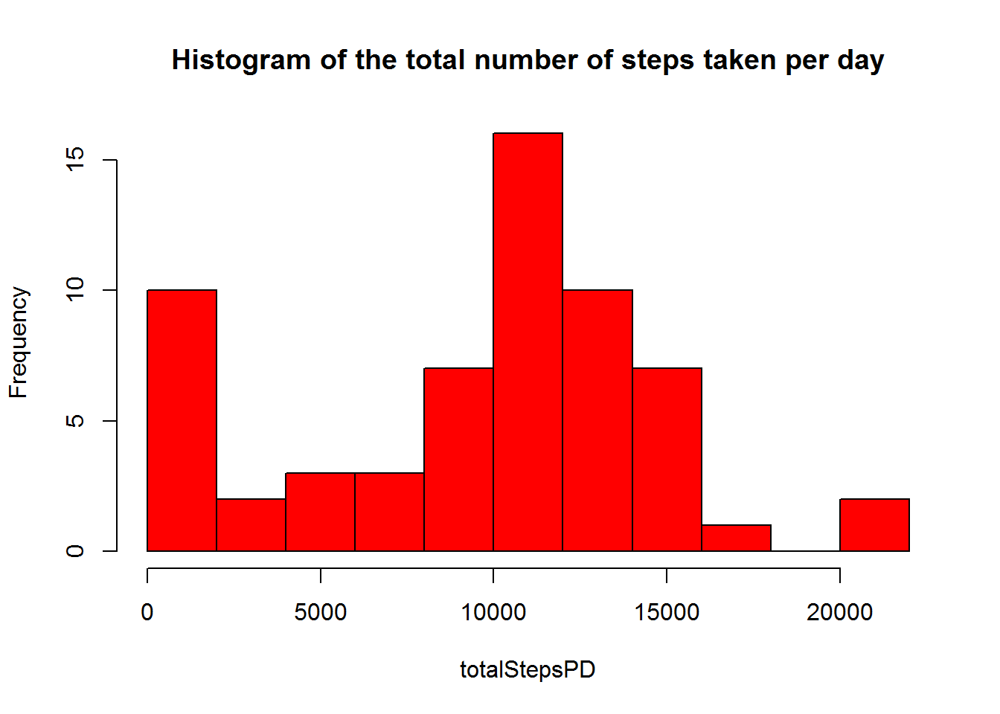
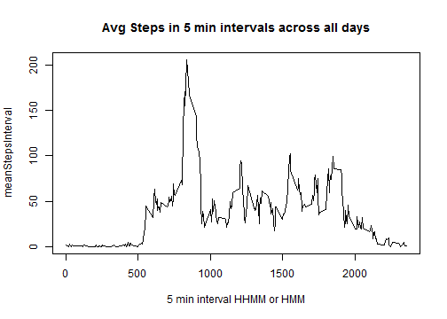
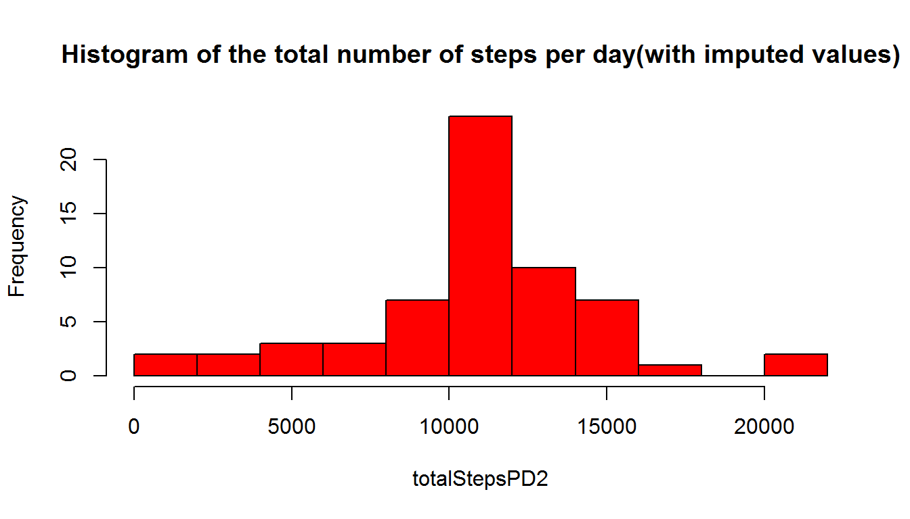
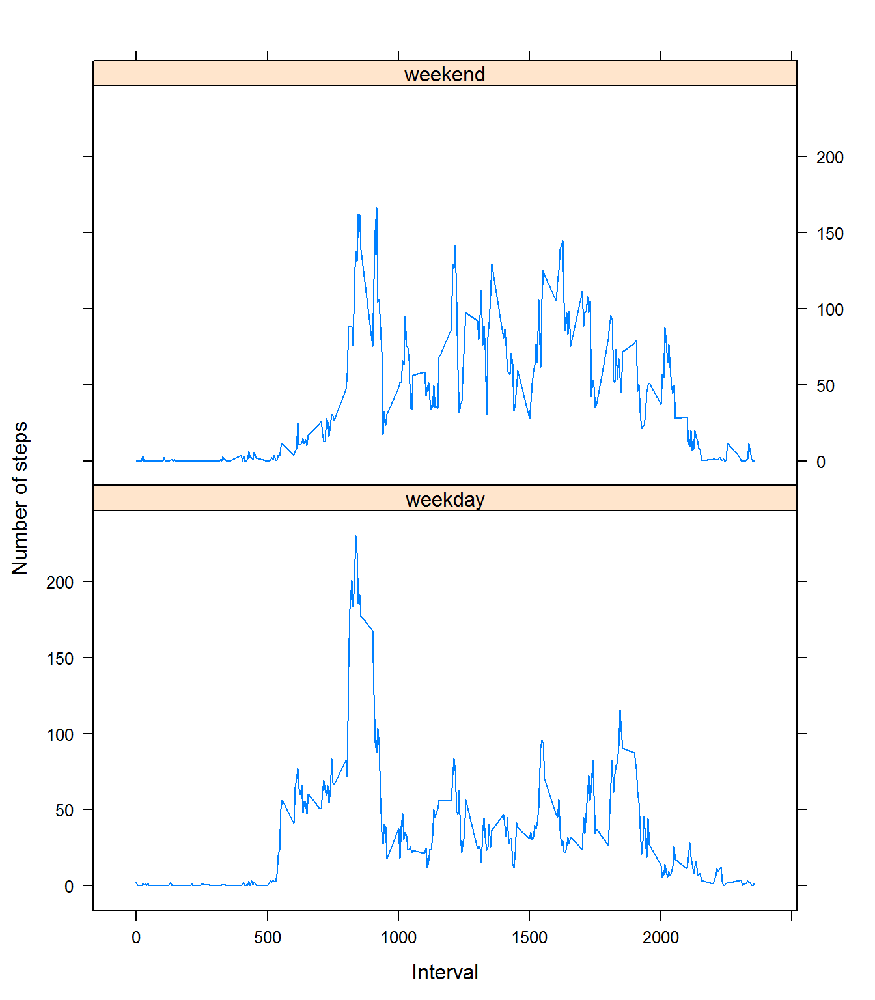

# Load basic libraries in R
3 libraries needed for this assignment


```r
# Don't echo the library loading up, just takes space
library(dplyr)
library(ggplot2)
library(lattice)
```

# Loading and preprocessing the data  
Load up the "activity.csv" and show the first few rows  
The variables included in this dataset are:  
- steps: Number of steps taking in a 5-minute interval (missing values are coded as NA)  
- date: The date on which the measurement was taken in YYYY-MM-DD format  
- interval: Identifier for the 5-minute interval in which measurement was taken  

The dataset is stored in a comma-separated-value (CSV) file and there are a total of 17,568 observations in this dataset.  

```r
#This enables saving of figures to the figure/ folder
knitr::opts_chunk$set(fig.path='figure/')
data<-read.csv("activity.csv")
head(data)
```

```
##   steps       date interval
## 1    NA 2012-10-01        0
## 2    NA 2012-10-01        5
## 3    NA 2012-10-01       10
## 4    NA 2012-10-01       15
## 5    NA 2012-10-01       20
## 6    NA 2012-10-01       25
```

```r
nrow(data)
```

```
## [1] 17568
```

# Calculating the total number of steps per day
1. Calculate the total number of steps taken per day
2. Make a histogram of the total number of steps taken each day
3. Calculate and report the mean and median of the total number of steps taken per day


```r
totalStepsPD<-tapply(data$steps,data$date,sum,na.rm=TRUE,simplify = TRUE)
hist(totalStepsPD,col="red", main="Histogram of the total number of steps taken per day",breaks = 8)
```

 

```r
meanStepsPD<-round(mean(totalStepsPD,na.rm=TRUE),0)
medianStepsPD<-round(median(totalStepsPD,na.rm=TRUE),0)
strMean<-paste0(meanStepsPD)
strMedian<-paste0(medianStepsPD)
print(paste("Mean steps per day was",meanStepsPD))
```

```
## [1] "Mean steps per day was 9354"
```

```r
print(paste("Median steps per day was",medianStepsPD))
```

```
## [1] "Median steps per day was 10395"
```

Mean steps per day was 9354 and median steps per day was 10395  
*Note na.rm=TRUE is used to remove all NAs from the calculation of the mean and the median*

# Average daily activity pattern  
1.    Make a time series plot (i.e. type = "l") of the 5-minute interval (x-axis) and the average number of steps taken, averaged across all days (y-axis)    
2.    Which 5-minute interval, on average across all the days in the dataset, contains the maximum number of steps?  


```r
# calculate avg steps taken averaged per interval across all days
meanStepsInterval<-tapply(data$steps,data$interval,mean, na.rm=TRUE,simplify=TRUE)
# timeSeries Plot
plot(names(meanStepsInterval),meanStepsInterval, type="l",
	 main="Avg Steps in 5 min intervals across all days",
	 xlab="5 min interval HHMM or HMM")
```

 

```r
#find max interval (reports only one interval if there is a tie for interval with max avg steps)
maxval<-max(meanStepsInterval)
timeval<-names(meanStepsInterval[which(meanStepsInterval==maxval)])
maxval<-round(maxval,1)
print(paste("The maximum number of steps are taken in the ",timeval,"interval"))
```

```
## [1] "The maximum number of steps are taken in the  835 interval"
```

```r
print(paste("The average value of steps taken in this interval is ",maxval))
```

```
## [1] "The average value of steps taken in this interval is  206.2"
```

The maximum number of steps on average are taken in the 835 5-minute interval. The average value of steps taken in this interval is 206.2  


# Imputing missing values
1.    Calculate and report the total number of missing values in the dataset (i.e. the total number of rows with NAs)

```r
# calculate missing values in data$steps
totalMissing<-sum(is.na(data$steps))
# double check other columns
totalMissingChk<-nrow(data)-(sum(complete.cases(data)))
```
The total number of missing values was 2304. 

2.    Devise a strategy for filling in all of the missing values in the dataset.   
In this case we have imputed missing values by using the the mean for that 5-minute interval across all days  

3.    Create a new dataset that is equal to the original dataset but with the missing data filled in.


```r
# Impute missing values, use the mean number of steps for a particular interval across all days
meanStepsPerDay<-tapply(data$steps,data$interval,mean,na.rm=TRUE,simplify=TRUE)
#if data unavailable for all days for a particular interval then make it 0
meanStepsPerDay[is.na(meanStepsPerDay)]=0
#create a lookup table
lookupTabledf=data.frame(interval=as.numeric(names(meanStepsPerDay)), meanVal=meanStepsPerDay)
#create a data table which has both steps and the imputed value
data2<-left_join(data,lookupTabledf,by="interval")
# Create new data set with missing data filled in
dataImputed<-data
dataImputed$steps<-ifelse(is.na(data2$steps),data2$meanVal,data2$steps)
# Display a few rows of the new dataset 
head(dataImputed)
```

```
##       steps       date interval
## 1 1.7169811 2012-10-01        0
## 2 0.3396226 2012-10-01        5
## 3 0.1320755 2012-10-01       10
## 4 0.1509434 2012-10-01       15
## 5 0.0754717 2012-10-01       20
## 6 2.0943396 2012-10-01       25
```


4.    Make a histogram of the total number of steps taken each day and Calculate and report the mean and median total number of steps taken per day. Do these values differ from the estimates from the first part of the assignment? What is the impact of imputing missing data on the estimates of the total daily number of steps?  

```r
totalStepsPD2<-tapply(dataImputed$steps,dataImputed$date,sum,simplify = TRUE)
hist(totalStepsPD2,breaks=10,col="red", 
	 main="Histogram of the total number of steps per day(with imputed values)")
```

 

```r
meanStepsPD<-round(mean(totalStepsPD2,na.rm=TRUE),0)
medianStepsPD<-round(median(totalStepsPD2,na.rm=TRUE),0)
strMean<-paste0(meanStepsPD)
strMedian<-paste0(medianStepsPD)
#totalStepsPD2-ifelse(is.na(totalStepsPD),0,totalStepsPD)
```
Total number of steps per day goes up (because instead of NAs now we have numbers for missing values). 
Mean steps per day was 10766 and median steps per day was 10766.
The mean and median are both higher after the NA's in the data are filled in with imputed values

*Note missing values have been replaced with the average value for that interval across all other days*

# Are there differences in activity patterns between weekdays and weekends?  

1.     Create a new factor variable in the dataset with two levels - "weekday" and "weekend" indicating whether a given date is a weekday or weekend day.

```r
dataImputed$weekend=weekdays(as.Date(x=dataImputed$date))
dataImputed$weekend=ifelse(dataImputed$weekend %in% c("Saturday","Sunday"),
						   "weekend","weekday")
dataImputed$weekend=as.factor(dataImputed$weekend)
```
2.    Make a panel plot containing a time series plot (i.e. type = "l") of the 5-minute interval (x-axis) and the average number of steps taken, averaged across all weekday days or weekend days (y-axis). 


```r
# compute average steps per interval for weekends
data1<-dataImputed %>% filter(weekend=="weekend") %>%group_by(interval) %>% summarise(avg=mean(steps))
data1$weekend=rep("weekend",nrow(data1))
# compute average steps per interval for weekedays
data2<-dataImputed %>% filter(weekend=="weekday") %>%group_by(interval) %>% summarise(avg=mean(steps))
data2$weekend=rep("weekday",nrow(data2))
# combine the two summaries; there might be a cleaner way to do this....
data3<-rbind(data1,data2)

# plot the avg steps per interval conditioned on weekend/weekday
xyplot(avg~interval|weekend,data=data3,type="l",ylab="Number of steps", xlab="Interval",layout=c(1,2))
```

 
